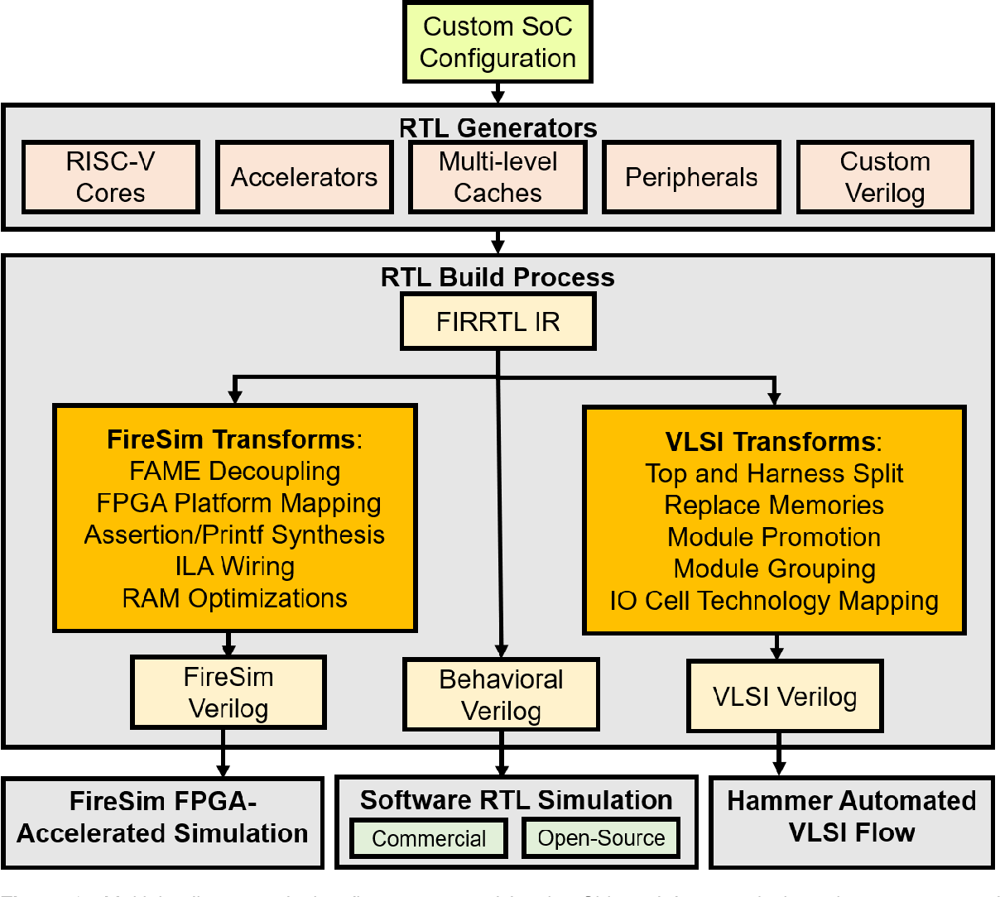

# Chip Tinkerer

Compiling various open-source projects to extract their best features, we aim to create a streamlined full-stack platform for SoC (System on a Chip) design verification.


## High-level platform

* [**Chipyard:**](https://github.com/x-tinkerer/chipyard)
An Agile RISC-V SoC Design Framework with in-order cores, out-of-order cores, accelerators, and more.


<br/><br/>

* [**ESP**](https://github.com/x-tinkerer/esp)
  Embedded Scalable Platforms: Heterogeneous SoC architecture and IP integration made easy.
  
<br/><br/>

* [**pulp-platform:**](https://github.com/pulp-platform)
  
<br/><br/>

* [**OpenTitan:**](https://github.com/x-tinkerer/opentitan)
OpenTitan: Open source silicon root of trust.

  

<br/><br/>
- [**litex:**](https://github.com/x-tinkerer/litex)
LiteX is developed and used by Enjoy-Digital since 2012 to co-develop full-systems with our partners and provide an convenient and efficient solutions to create SoCs on FPGA based systems. Here are some of the last project we worked on with our partners.

<br/><br/>

- [**migen:**](https://github.com/x-tinkerer/migen)A Python toolbox for building complex digital hardware.
  ```python
  from migen import *
  from migen.build.platforms import m1
  plat = m1.Platform()
  led = plat.request("user_led")
  m = Module()
  counter = Signal(26)
  m.comb += led.eq(counter[25])
  m.sync += counter.eq(counter + 1)
  plat.build(m)
  ```
  <br/><br/>

- [**cocotb:**](https://github.com/x-tinkerer/cocotb)
cocotb, a coroutine based cosimulation library for writing VHDL and Verilog testbenches in Python.


## Processor cores

- [**riscv-mini:**](https://github.com/x-tinkerer/riscv-mini)
  Simple RISC-V 3-stage Pipeline in Chisel.
  

<br/>

- [**riscv-sodor:**](https://github.com/x-tinkerer/riscv-sodor)
  Educational microarchitectures for risc-v isa.
  

<br/>

- [**riscv-boom:**](https://github.com/bytetinkerer/riscv-boom)
  SonicBOOM: The Berkeley Out-of-Order Machine
  

<br/>

- [**rocket-chip:**](https://github.com/x-tinkerer/rocket-chip)
  Rocket Chip Generator


<br/>

- [**Ibex:**](https://github.com/x-tinkerer/ibex)
Ibex is a production-quality open source 32-bit RISC-V CPU core written in SystemVerilog. The CPU core is heavily parametrizable and well suited for embedded control applications. Ibex is being extensively verified and has seen multiple tape-outs. Ibex supports the Integer (I) or Embedded (E), Integer Multiplication and Division (M), Compressed (C), and B (Bit Manipulation) extensions.


<br/>

- **snitch:** https://github.com/x-tinkerer/snitch

<br/>

- **testchipip:** https://github.com/x-tinkerer/testchipip

## Core simulator and modeling

- **riscv-isa-sim:** https://github.com/riscv-software-src/riscv-isa-sim

<br/>

- [**Ripes:**](https://github.com/x-tinkerer/Ripes)
A graphical processor simulator and assembly editor for the RISC-V ISA.


<br/>

- **Performance Modeling:** https://github.com/x-tinkerer/riscv-perf-model


## System-on-Chip

- [**Xiangshan:**](https://github.com/x-tinkerer/XiangShan)
  Open-source high-performance RISC-V processor


## SoC simulator
- [**gem5:** ](https://github.com/x-tinkerer/gem5)
The gem5 simulator is a modular platform for computer-system architecture research, encompassing system-level architecture as well as processor microarchitecture. 


  * **arm-gem5-rsk** :https://github.com/x-tinkerer/arm-gem5-rsk
Official repository of the Arm Research Starter Kit on System Modeling using gem5

<br/>

- [**The Simulation Engine - SimEng**](https://github.com/x-tinkerer/SimEng)
  SimEng is a framework for building modern, cycle-accurate processor simulators. Its goals are to be:

  - Fast, typically 4-5X faster than gem5
  - Easy to use and modify to model desired microarchitecture configurations.  New cores can be configured in just a few hours
  - Scalable, from simple scalar microarchitectures up to the most sophisticated, superscalar, out-of-order designs
  - Capable of supporting a wide range of instruction set architectures (ISAs), starting with AArch64 and RISC-V, but eventually including x86, POWER, etc.
  - Accurate, aiming for simulated cycle times being within 5-10% of real hardware
  - Open source, with a permissive license to enable collaboration across academia and industry


  * **Modelling_Apple_M1_CPU_Architecture** :https://github.com/x-tinkerer/Modelling_Apple_M1_CPU_Architecture

<br/>

- [**DRAMSys**](https://github.com/x-tinkerer/DRAMSys)
  DRAMSys a SystemC TLM-2.0 based DRAM simulator.
  

<br/>

- [**DRAMsim3**](https://github.com/x-tinkerer/DRAMsim3)
DRAMsim3: a Cycle-accurate, Thermal-Capable DRAM Simulator.

  - Gem5 integration: works with a forked Gem5 version, see https://github.com/umd-memsys/gem5 at dramsim3 branch for reference.

  - SST integration: see http://git.ece.umd.edu/shangli/sst-elements/tree/dramsim3 for reference. We will try to merge to official SST repo.

  - ZSim integration: see http://git.ece.umd.edu/shangli/zsim/tree/master for reference.

## System simulators

- [**QEMU:**](https://www.qemu.org/) is a generic and open source machine emulator and virtualizer.

- [**unicorn:**](https://github.com/x-tinkerer/unicorn)
  Unicorn CPU emulator framework (ARM, AArch64, M68K, Mips, Sparc, PowerPC, RiscV, S390x, TriCore, X86)

## Operating Systems

- [**vivado-risc-v:**](https://github.com/bytetinkerer/vivado-risc-v/tree/master)

## Toolchains

## Applications

## Open Source EDA

[**OSS CAD Suite:** ](https://github.com/x-tinkerer/oss-cad-suite-build)Multi-platform nightly builds of open source digital design and verification tools


### RTL Synthesis 
 * [Yosys](https://github.com/YosysHQ/yosys) RTL synthesis with extensive Verilog 2005 support
 * [Amaranth](https://github.com/amaranth-lang/amaranth) refreshed Python toolbox for building complex digital hardware
 * [Migen](https://github.com/m-labs/migen) Python toolbox for building complex digital hardware
 * [ABC](https://people.eecs.berkeley.edu/~alanmi/abc/) A System for Sequential Synthesis and Verification
 * [GHDL](https://github.com/ghdl/ghdl) VHDL 2008/93/87 simulator (linux-x64 and darwin-x64 platforms only)

### Plugins
 * [GHDL plugin](https://github.com/ghdl/ghdl-yosys-plugin) VHDL synthesis based on GHDL (linux-x64 and darwin-x64 platforms only)

### Formal Tools
 * [sby](https://github.com/YosysHQ/sby) a front-end driver program for Yosys-based formal hardware verification flows.
 * [mcy](https://github.com/YosysHQ/mcy) Mutation Cover with Yosys
 * [eqy](https://github.com/YosysHQ/eqy) Equivalence Checking with Yosys
 * [sby-gui](https://github.com/YosysHQ/sby-gui) GUI for sby
 * [aiger](https://github.com/arminbiere/aiger) AIGER tools including bounded model checker
 * [avy](https://bitbucket.org/arieg/extavy) Interpolating Property Directed Reachability tool
 * [Boolector](https://github.com/Boolector/boolector) SMT solver and BTOR model checker
 * [Yices 2](https://github.com/SRI-CSL/yices2) SMT solver
 * [Super prove](https://github.com/sterin/super-prove-build) ABC-based AIGER hardware model checker (linux-x64 platform only)
 * [Pono](https://github.com/upscale-project/pono) an SMT-based model checker built on [smt-switch](https://github.com/makaimann/smt-switch)
 * [Z3](https://github.com/Z3Prover/z3) SMT solver
 * [Bitwuzla](https://github.com/bitwuzla/bitwuzla) SMT solver

### PnR
 * [nextpnr](https://github.com/YosysHQ/nextpnr) a portable FPGA place and route tool (generic, ice40, ecp5, machxo2, nexus, gowin)
 * [Project IceStorm](https://github.com/YosysHQ/icestorm) tools for working with Lattice ICE40 bitstreams
 * [Project Trellis](https://github.com/YosysHQ/prjtrellis) tools for working with Lattice ECP5 bitstreams
 * [Project Oxide](https://github.com/gatecat/prjoxide) tools for working with Lattice Nexus bitstreams
 * [Project Apicula](https://github.com/YosysHQ/apicula) tools for working with Gowin bitstreams
 
### FPGA board programming tools
 * [openFPGALoader](https://github.com/trabucayre/openFPGALoader) universal utility for programming FPGA
 * [dfu-util](http://dfu-util.sourceforge.net/) Device Firmware Upgrade Utilities
 * [ecpprog](https://github.com/gregdavill/ecpprog) basic driver for FTDI based JTAG probes, to program ECP5 FPGAs
 * [ecpdap](https://github.com/adamgreig/ecpdap) program ECP5 FPGAs and attached SPI flash using CMSIS-DAP probes in JTAG mode
 * [fujprog](https://github.com/kost/fujprog) ULX2S / ULX3S JTAG programmer
 * [openocd](http://openocd.org/) Open On-Chip Debugger
 * [icesprog](https://github.com/wuxx/icesugar/tree/master/tools/src) iCESugar FPGA board programmer
 * [iceprogduino](https://github.com/OLIMEX/iCE40HX1K-EVB/tree/master/programmer/iceprogduino) Olinuxino based programmer for iCE40HX1K-EVB
 * [TinyFPGA](https://github.com/tinyfpga/TinyFPGA-Bootloader) USB Bootloader
 * [TinyFPGA-B](https://github.com/tinyfpga/TinyFPGA-B-Series) TinyFPGA B2 Board programmer
 * [iceFUN](https://github.com/pitrz/icefunprog) iceFUN Programmer
 
### Simulation/Testing
 * [GTK Wave](https://github.com/gtkwave/gtkwave) fully featured GTK+ based wave viewer
 * [verilator](https://github.com/verilator/verilator) Verilog/SystemVerilog simulator
 * [iverilog](https://github.com/steveicarus/iverilog) Verilog compilation system
 * [cocotb](https://github.com/cocotb/cocotb) coroutine based cosimulation library for writing VHDL and Verilog testbenches in Python


<br/>

[**F4PGA:**](https://github.com/x-tinkerer/f4pga)FOSS Flow For FPGA


<br/><br/>

# CHIPS Alliance Project Repositories Table of Contents
| Project Name               | Description                                                                                                      | Repositories                                                                                                                                                                                                                                                                                                                        |
| -------------------------- | ---------------------------------------------------------------------------------------------------------------- | ----------------------------------------------------------------------------------------------------------------------------------------------------------------------------------------------------------------------------------------------------------------------------------------------------------------------------------- |
| Caliptra                   | The Caliptra project focuses on development of HW and SW IP for the Caliptra Root of Trust                       | - [caliptra](https://github.com/chipsalliance/Caliptra)<br>- [caliptra-rtl](https://github.com/chipsalliance/caliptra-rtl)<br>- [caliptra-sw](https://github.com/chipsalliance/caliptra-sw)<br>- [caliptra-ureg](https://github.com/chipsalliance/caliptra-ureg)<br>- [caliptra-dpe](https://github.com/chipsalliance/caliptra-dpe) |
| OpenFASOC                  | Fully Open Source Automated Analog Block Generation built on top of OpenROAD, Magic, Netgen, Klayout and Ngspice | - [OpenFASOC](https://github.com/idea-fasoc/OpenFASOC)<br>- [idea-fasoc](https://github.com/idea-fasoc/idea-fasoc)                                                                                                                                                                                                                  |
| RocketChip                 | The SoC generator instantiates the RISC-V Rocket Core and relevant component.                                    | - [rocket-chip](https://github.com/chipsalliance/rocket-chip)                                                                                                                                                                                                                                                                       |
| SV tests                   | SystemVerilog test framework for checking SV spec support coverage in various open source tools                  | - [sv-tests](https://github.com/chipsalliance/sv-tests)                                                                                                                                                                                                                                                                             |
| Verible                    | Parse SystemVerilog (IEEE 1800-2017) with a suite of SystemVerilog developer tools                               | - [verible](https://github.com/chipsalliance/verible)                                                                                                                                                                                                                                                                               |
| FPGA Interchange format    | Vendor agnostic FPGA devices and designs description for interoperability between different FPGA tools           | - [fpga-interchange-schema](https://github.com/chipsalliance/fpga-interchange-schema)                                                                                                                                                                                                                                               |
| Surelog and UHDM           | SureLog: SystemVerilog 2017 Pre-processor, Parser, UHDM Compiler. UHDM: Hardware Data Model framework.           | - [Surelog](https://github.com/chipsalliance/Surelog)<br>- [UHDM](https://github.com/chipsalliance/UHDM)<br>- [UHDM-integration-tests](https://github.com/chipsalliance/UHDM-integration-tests)                                                                                                                                     |
| F4PGA                      | Free and open source toolchain for FPGA devices                                                                  | - [f4pga](https://github.com/chipsalliance/f4pga)                                                                                                                                                                                                                                                                                   |
| FPGA tool perf             | Framework for automatic FPGA toolchains benchmarking                                                             | - [fpga-tool-perf](https://github.com/chipsalliance/fpga-tool-perf)<br>- [actions](https://github.com/chipsalliance/actions)                                                                                                                                                                                                        |
| OmniXtend                  | Cache coherence framework for RISC-V based on TileLink                                                           | - [omnixtend](https://github.com/chipsalliance/omnixtend)<br>- [OmnixtendEndpoint](https://github.com/chipsalliance/OmnixtendEndpoint)<br>- [OmniXtend_RemoteAgent_RISC-V](https://github.com/chipsalliance/OmniXtend_RemoteAgent_RISC-V)                                                                                           |
| RISCV-DV                   | Open source verification tool for RISC-V processors                                                              | - [riscv-dv](https://github.com/chipsalliance/riscv-dv)                                                                                                                                                                                                                                                                             |
| Intel Compiler for SystemC | Open source SystemC to SystemVerilog translation tool and SingleSource library                                   | - [systemc-compiler](https://github.com/chipsalliance/systemc-compiler)                                                                                                                                                                                                                                                             |
| Chisel                     | Support the Chisel Hardware Construction Language and related projects                                           | - [chisel](https://github.com/chipsalliance/chisel)                                                                                                                                                                                                                                                                                 |

<br/><br/>

# OpenHW Group Project Repositories Table of Contents 

| Working Group    				| Repo																			| Description												|      
| --------------------    		| --------------------    														| -------------------- 										|
| Cores TG    					| [Core-v-cores roadmap](https://github.com/openhwgroup/core-v-cores)			|  															|
|								| [CTG meetings and minutes](https://github.com/openhwgroup/programs/tree/master/TGs/cores-task-group)|							|
| 		    					| [CVA6](https://github.com/openhwgroup/cva6)									| 6-stage, application-class core	 						|
|     							| [CVA5](https://github.com/openhwgroup/cva5)									| 5-stage, FPGA-optimized application-class core  |
|     							| [CVW](https://github.com/openhwgroup/cvw)										| 5-stage, application-class core with education focus |
|     							| [CV32E40P](https://github.com/openhwgroup/cv32e40p)							| 4-stage, embedded-class core implementing PULP extensions |
|     							| [CV32E40S](https://github.com/openhwgroup/cv32e40s)							| 4-stage, embedded-class core with security focus |
|     							| [CV32E40X](https://github.com/openhwgroup/cv32e40x)							| 4-stage, embedded-class core supporting X-Interface |
|     							| [CV32E41P](https://github.com/openhwgroup/cv32e41p)							| 4-stage, embedded-class core prototyping Zfinx and Zce |
|     							| [CV32E20](https://github.com/openhwgroup/cve2)							    | 2-stage, embedded-class microcontroller core and core complex |
|     							| [CV-HPDCACHE](https://github.com/openhwgroup/cv-hpdcache)						| High performance L1 Data Cache |
| Verification TG    			| [VTG meetings and minutes](https://github.com/openhwgroup/programs/tree/master/TGs/verification-task-group)|   |
|								| [CORE-V Verif](https://github.com/openhwgroup/core-v-verif)					| Common test bench for OpenHW Cores |
|     							| [FORCE RISC-V](https://github.com/openhwgroup/force-riscv)					| Advanced RISC-V instruction set generator |
|     							| [ARVM](https://github.com/openhwgroup/advanced-riscv-verification-methodologies)					| Advanced RISC-V Verification Methodologies |
| Software TG     				| [SWTG meetings and minutes](https://github.com/openhwgroup/core-v-sw)			|  												|
| 			    				| [CORE-V GNU Tools](https://github.com/openhwgroup/corev-gcc)					| GNU Tools Project for embedded-class CORE-V cores |
| 			    				| [CORE-V LLVM](https://github.com/openhwgroup/corev-llvm-project)				| LLVM Tools Project for embedded-class CORE-V cores |
| 			    				| [CORE-V FreeRTOS Kernel](https://github.com/openhwgroup/core-v-freertos-kernel)				| FreeRTOS Kernel for embedded-class CORE-V cores |
| 			    				| [CORE-V FreeRTOS](https://github.com/openhwgroup/core-v-freertos)				| FreeRTOS for embedded-class CORE-V cores |
| 			    				| [CORE-V QEMU](https://github.com/openhwgroup/corev-qemu)						| QEMU emulator for CORE-V-MCU	 |
| 			    				| [CORE-V SDK](https://github.com/openhwgroup/core-v-sdk)						| SDK and IDE for embedded-class CORE-V cores	 |
| Hardware TG     				| [HWTG meetings and minutes](https://github.com/openhwgroup/programs/tree/master/TGs/hardware-task-group)					|  |
|     							| [CORE-V-MCU](https://github.com/openhwgroup/core-v-mcu)						| ASIC and FPGA MCU implementation of CV32E40P |
|     							| [CORE-V-MCU-DEVKIT](https://github.com/openhwgroup/core-v-mcu-devkit)			| Devkit for CORE-V-MCU |
|     							| [CORE-V-POLARA-APU](https://github.com/openhwgroup/core-v-polara-apu)			| Multicore CVA6/CVVEC ASIC with OpenPiton |
| Technical Working Group		| [OpenHW project dashboard](https://github.com/openhwgroup/programs/tree/master/dashboard)		| |
|								| [Project Description Folders](https://github.com/openhwgroup/programs/tree/master/Project-Descriptions-and-Plans) | |
|								| [OpenHW Project process and templates](https://github.com/openhwgroup/programs/tree/master/process)		| |